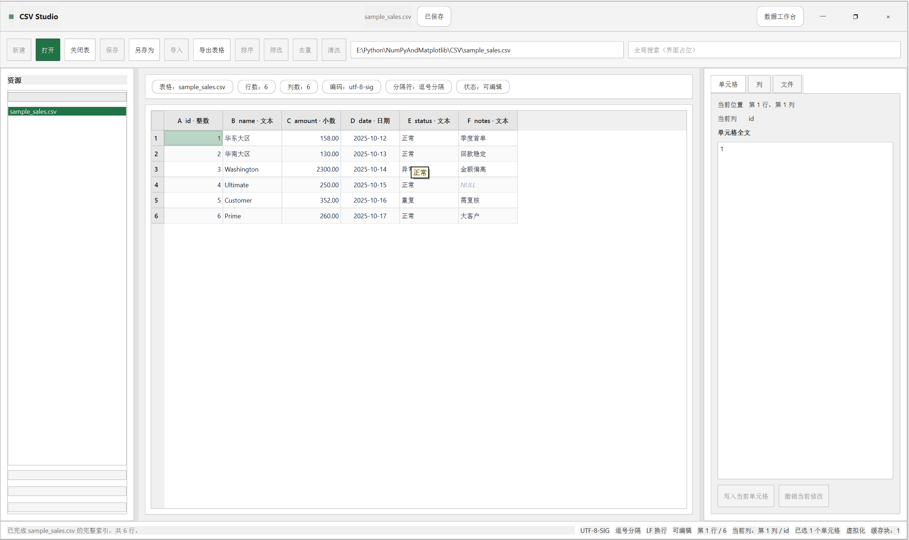

# CSV Studio

`CSV Studio` 是一个面向大规模 CSV 的桌面端查看器原型，基于 `PySide6` 构建，当前版本重点是“工业灰白主题 + 表格浏览 + 大文件后台索引 + 可见加载进度”。

## 当前能力

- 灰白工业风界面，视觉方向参考 Excel 一类生产力软件
- 自定义无边框窗口壳层，去掉系统原生标题栏造成的白色顶头
- 打开本地 CSV 文件，或直接在路径输入框中粘贴路径回车打开
- 通过表格形式浏览 CSV 数据，自带水平 / 垂直滚动条
- 使用“预览先展示 + 后台建立索引 + 按需加载”方式浏览大文件，避免打开时锁死界面
- 提供可见的加载进度条和状态提示，能看到预览阶段与完整索引阶段
- 显示列结构、样本数据质量、状态条与右侧文件 / 单元格信息
- 支持导出当前预览片段为 CSV，方便留样或二次处理

## 安装方式

- windows 直接可运行的'exe' 安装包，下载zip解压后双击 `CSVStudio.exe` 即可使用 [点击下载exe安装包 (ZIP)](https://drive.google.com/file/d/1v402CVS1Ts3lyRIbbF59r7YFXOTxyUtz/view?usp=drive_link)
- 其他平台或想直接运行源码的用户，请参考下面的 Python 环境安装说明

## Python 版本与依赖

- 当前已验证环境：`Python 3.11.10`
- 推荐使用：`Python 3.11.x`
- 当前直接依赖：`PySide6 6.8.0.2`、`pandas 2.2.3`

如果你想用 `pip` 单独安装环境，可以直接执行：

```powershell
pip install -r requ.txt
```

如果你想先新建一个虚拟环境，推荐流程如下：

```powershell
python -m venv .venv
.\.venv\Scripts\activate
pip install -r requ.txt
```

## 运行方式

根据 `AGENTS.md` 的环境约束，运行命令时请使用：

```powershell
conda run -n NumPyAndMatplotlib python run_csv_studio.py
```

如果你使用的是纯 `pip` 环境，也可以直接运行：

```powershell
python run_csv_studio.py
```

## 当前目录结构

```text
CSV/
├─ AGENTS.md
├─ ARCHITECTURE.md
├─ README.md
├─ requ.txt
├─ run_csv_studio.py
└─ csv_studio/
   ├─ __init__.py
   ├─ main.py
   ├─ main_window.py
   ├─ styles.py
   ├─ models/
   │  └─ csv_table_model.py
   ├─ services/
   │  └─ csv_service.py
   ├─ widgets/
   │  └─ title_bar.py
   └─ workers/
      └─ csv_loader.py
```

## 当前架构重点

1. 表现层：`main_window.py` + `styles.py`
   负责工业灰白主题、无边框窗口壳层、可见进度条、主表格区和状态条。

2. 数据层：`csv_service.py`
   负责 CSV 编码 / 分隔符检测、样本分析、分块索引构建、随机块读取。

3. 模型层：`csv_table_model.py`
   使用 Qt 的 `QAbstractTableModel` 将分块数据接入 `QTableView`，并提供预览片段导出。

4. 后台加载层：`csv_loader.py`
   负责先返回预览结果，再在后台线程中建立完整索引，并持续回传进度。

## CSV Studio 项目架构设计

[CSV Studio 项目架构设计](ARCHITECTURE.md)

## 下一阶段规划

- 增加真正的筛选、排序、去重和列级数据清洗
- 增加后台加载取消、错误恢复和更细粒度的进度提示
- 增加可编辑单元格与保存流程
- 增加多文件标签页和更稳定的工作区管理
